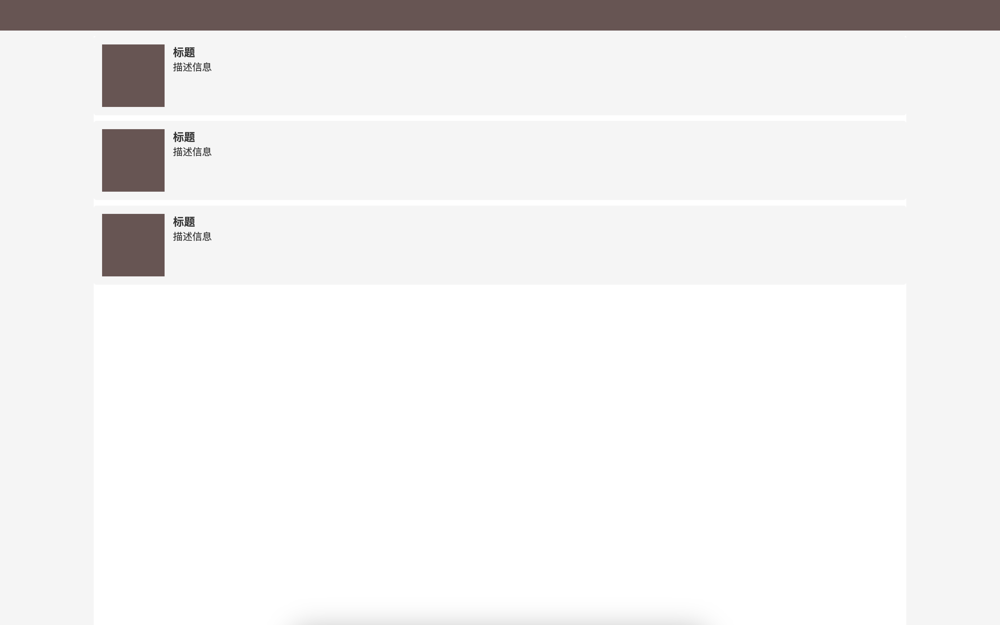

# gray-mode-web

一个揭秘 Web 网站全站变灰的实现

## 实现原理

机遇 CSS 的新特性 filter 实现

```
html {
  filter: grayscale(0.9);
  -webkit-filter: grayscale(0.9);
}
```

其中 grayscale()中的参数值范围是在：0 - 1 之间，值越大则灰度越高
webkit 是为了处理浏览器兼容性

## 效果产出


